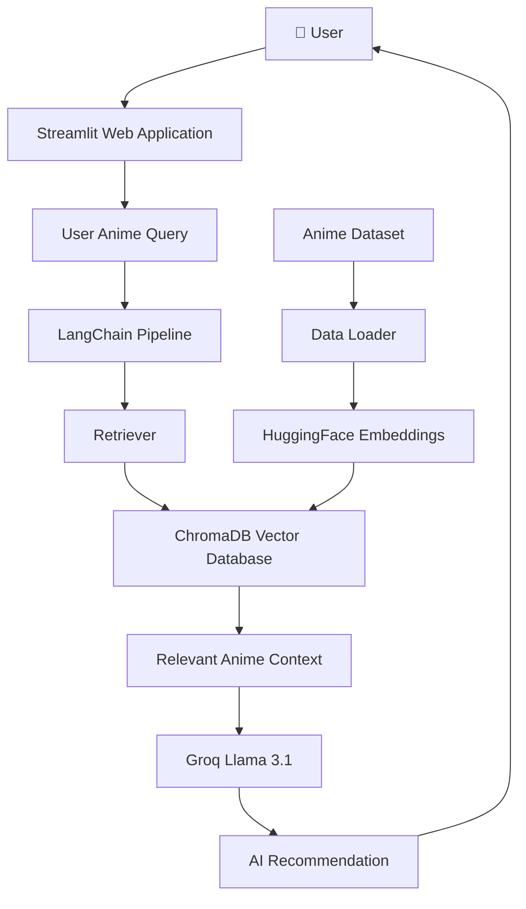
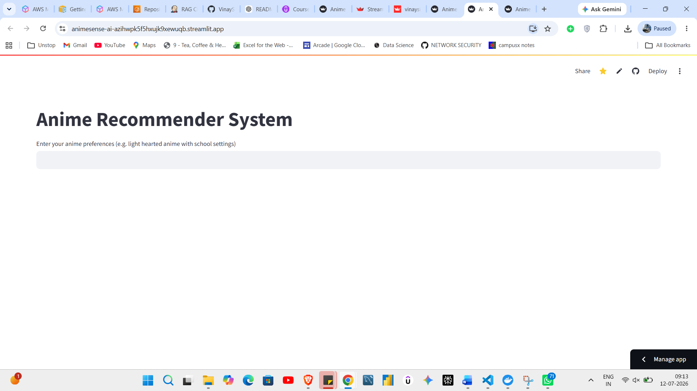
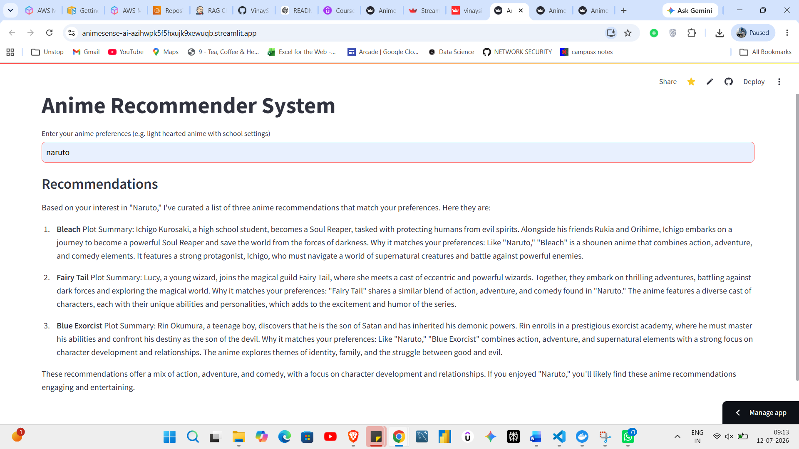
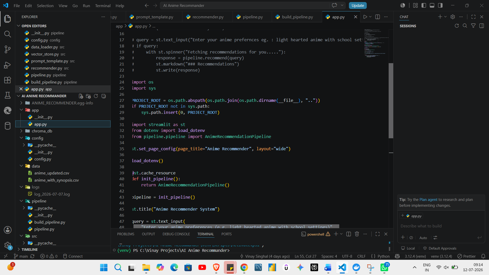

# 🎌 AnimeSense AI

> **An AI-powered Anime Recommendation System built using LangChain, Groq Llama 3.1, ChromaDB, HuggingFace Embeddings, and Streamlit.**

---

## 🚀 Live Demo

🌐 https://animesense-ai-azihwpk5f5hxujk9xewuqb.streamlit.app/

---

## 💻 GitHub Repository

https://github.com/VinaySinghal1/AnimeSense-AI

---

# 📖 Project Overview

AnimeSense AI is an intelligent Anime Recommendation System that leverages Retrieval-Augmented Generation (RAG) to provide personalized anime recommendations based on user preferences.

Instead of relying on traditional filtering techniques, the system performs semantic search over anime descriptions stored inside ChromaDB and generates natural-language recommendations using Groq's Llama 3.1 model.

---

# ✨ Features

- 🎌 AI-powered Anime Recommendation
- 🤖 Groq Llama 3.1 Integration
- 🧠 Retrieval-Augmented Generation (RAG)
- 🔍 Semantic Search
- 📚 ChromaDB Vector Database
- 🧩 HuggingFace Embeddings
- ⚡ LangChain Pipeline
- 🌐 Streamlit Web Interface
- 📝 Logging & Custom Exception Handling

---

# 🏗️ System Architecture



---

# ⚙️ Tech Stack

## Programming Language

- Python

## Frontend

- Streamlit

## LLM

- Groq Llama 3.1

## Framework

- LangChain

## Embedding Model

- sentence-transformers

## Vector Database

- ChromaDB

## Data Processing

- Pandas

## Version Control

- Git
- GitHub

---

# 📸 Screenshots

## 🏠 Home Page

Displays the main AnimeSense AI interface where users can enter their anime preferences.



---

## 🤖 AI Recommendation

The chatbot generates personalized anime recommendations using Retrieval-Augmented Generation (RAG) and Groq Llama 3.1.



---

## 💻 Source Code Structure

The project follows a modular architecture where each module has a specific responsibility, making the codebase clean, maintainable, and scalable.



---

# 📂 Project Structure

```text
AnimeSense-AI
│
├── app
│   ├── app.py
│   └── __init__.py
│
├── config
│   └── config.py
│
├── data
│   ├── anime_updated.csv
│   └── anime_with_synopsis.csv
│
├── pipeline
│   ├── build_pipeline.py
│   └── pipeline.py
│
├── src
│   ├── data_loader.py
│   ├── prompt_template.py
│   ├── recommender.py
│   └── vector_store.py
│
├── utils
│   ├── logger.py
│   └── custom_exception.py
│
├── chroma_db
├── logs
├── requirements.txt
├── setup.py
└── README.md
```

---

# ⚙️ Installation

## Clone Repository

```bash
git clone https://github.com/VinaySinghal1/AnimeSense-AI.git

cd AnimeSense-AI
```

---

## Create Virtual Environment

Windows

```bash
python -m venv venv

venv\Scripts\activate
```

Linux / Mac

```bash
python3 -m venv venv

source venv/bin/activate
```

---

## Install Dependencies

```bash
pip install -r requirements.txt

pip install -e .
```

---

# 🔑 Environment Variables

Create a `.env` file inside the project root.

```
GROQ_API_KEY=your_groq_api_key
```

---

# ▶️ Run Locally

```bash
streamlit run app/app.py
```

---

# ☁️ Streamlit Cloud Deployment

The application is deployed on **Streamlit Community Cloud**.

Deployment Workflow:

GitHub Repository

↓

Streamlit Cloud

↓

Automatic Build

↓

Application Deployment

↓

Live AI Anime Recommendation

---

# 📦 Requirements

- LangChain
- LangChain Community
- LangChain Groq
- LangChain HuggingFace
- ChromaDB
- Streamlit
- Pandas
- Sentence Transformers
- Python Dotenv

---

# 🔮 Future Improvements

- User Authentication
- Personalized Recommendations
- Recommendation History
- Multiple LLM Support
- Voice Search
- Multi-language Support
- User Rating System
- Anime Trailer Integration

---

# 👨‍💻 Author

**Vinay Singhal**

Artificial Intelligence & Data Science Student

GitHub

https://github.com/VinaySinghal1

---

# ⭐ If you like this project

Please give this repository a ⭐ on GitHub.